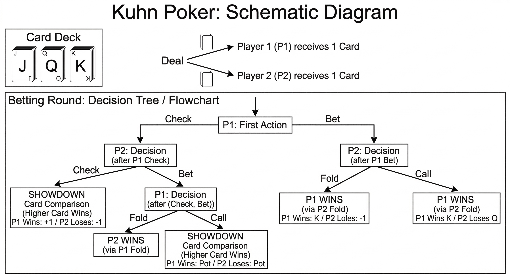

# Kuhn Poker AI: Solving Imperfect-Information Games with CFR

This project implements the **Counterfactual Regret Minimization (CFR)** algorithm from scratch to solve Kuhn Poker, a simplified zero-sum, imperfect-information game. 

It serves as a fundamental stepping stone and algorithm verification project before scaling up to tackle the immense complexity of full Texas Hold'em.

## Rules of Kuhn Poker

Kuhn Poker is the simplest standard model for poker games:

- **Deck:** Only 3 cards: Jack (J), Queen (Q), and King (K).
- **Players:** 2 players. Each receives 1 private card.
- **Ante:** Both players put 1 chip into the pot to start.
- **Action:** Players can either **Pass** (Check/Fold) or **Bet** (1 chip). 
- **Showdown:** If neither folds, the player with the higher card wins the pot.

## Vanilla CFR

1. **Counterfactual Value:** Calculates the expected utility of a specific action, assuming the agent deterministically played that action to reach the current state.
2. **Instantaneous Regret:** Measures how much the agent "regrets" not taking a different action compared to its current strategy.
3. **Regret Matching:** Updates the strategy for the next iteration proportionally to the accumulated positive regrets.
4. **Average Strategy:** The long-term average of all iteration strategies guarantees convergence to the Nash Equilibrium.

## Results

After training, the CFR algorithm successfully converged to the theoretical Nash Equilibrium.

Interestingly, Kuhn Poker doesn't have just one fixed equilibrium for Player 1. It has a **continuous family of equilibria** based on a variable $\alpha \in [0, 1/3]$. If Player 1 chooses to bluff with a Jack at probability $\alpha$, they MUST value-bet with a King at probability $3\alpha$ to remain unexploitable.

#### Player 1 (Acts First)

The most remarkable result is the correlation in Player 1's strategy. The algorithm independently discovered that to make a bluffing frequency of `0.2243` ($\alpha$) unexploitable, it had to value-bet its Kings at `0.6788` (which is exactly $3\alpha$). It learned this complex mathematical relationship purely through self-play and regret minimization!

| **Info Set** | **Card**      | **History**     | **AI Trained Bet (%)** | **Theoretical NE Bet (%)**           | **Interpretation (What is the AI thinking?)**                                                                                                         |
| ------------ | ------------- | --------------- | ---------------------- | ------------------------------------ | ----------------------------------------------------------------------------------------------------------------------------------------------------- |
| **`1`**      | **J** (Worst) | Start           | **22.4%**              | $\alpha \in [0, 33.3\%]$             | **The Optimal Bluff:** The AI randomly bluffs to avoid being predictable.                                                                             |
| **`2`**      | **Q** (Mid)   | Start           | **0.0%**               | $0\%$                                | **Pot Control:** Never bet first with a mid-card. Check to see the showdown cheaply.                                                                  |
| **`3`**      | **K** (Best)  | Start           | **67.9%**              | $3\alpha$ (approx **67.3%**)         | **Value vs. Trap:** The AI perfectly balanced its $22.4\%$ bluffing rate by betting the King $\sim67.9\%$ of the time, keeping the opponent guessing! |
| **`1pb`**    | **J** (Worst) | Pass -> Opp Bet | **0.0%**               | $0\%$                                | **Smart Fold:** Give up the worst card against aggression.                                                                                            |
| **`2pb`**    | **Q** (Mid)   | Pass -> Opp Bet | **56.1%**              | $\alpha + 33.3\%$ (approx **55.7%**) | **The Bluff Catcher:** Since the AI checked, it knows the opponent might bluff. It calls slightly more than half the time to catch them.              |
| **`3pb`**    | **K** (Best)  | Pass -> Opp Bet | **100.0%**             | $100\%$                              | **The Trap Sprung:** It checked earlier to bait a bet, and now calls with the guaranteed winning card.                                                |

#### Player 2 (Acts Second)

Unlike Player 1, Player 2's theoretical Nash Equilibrium is strictly unique and fixed. Our AI matched these fixed probabilities almost flawlessly.

| **Info Set** | **Card**      | **History** | **AI Trained Bet (%)** | **Theoretical NE Bet (%)** | **Interpretation (What is the AI thinking?)**                                                             |
| ------------ | ------------- | ----------- | ---------------------- | -------------------------- | --------------------------------------------------------------------------------------------------------- |
| **`1p`**     | **J** (Worst) | Opp Passed  | **33.4%**              | $33.3\%$                   | **Opportunistic Bluff:** If P1 shows weakness (checks), bluff exactly 1/3 of the time to steal the pot.   |
| **`1b`**     | **J** (Worst) | Opp Bet     | **0.0%**               | $0\%$                      | **Respect Aggression:** Fold the worst hand if the opponent bets.                                         |
| **`2p`**     | **Q** (Mid)   | Opp Passed  | **0.0%**               | $0\%$                      | **Showdown Value:** If P1 checked, just check behind to safely win against a Jack.                        |
| **`2b`**     | **Q** (Mid)   | Opp Bet     | **33.3%**              | $33.3\%$                   | **Defensive Bluff Catching:** Call exactly 1/3 of the time to keep P1 from bluffing too much with a Jack. |
| **`3p`**     | **K** (Best)  | Opp Passed  | **100.0%**             | $100\%$                    | **Pure Value Bet:** Always bet the best hand when checked to.                                             |
| **`3b`**     | **K** (Best)  | Opp Bet     | **100.0%**             | $100\%$                    | **Easy Call:** Always call a bet when holding the unbeatable card.                                        |

